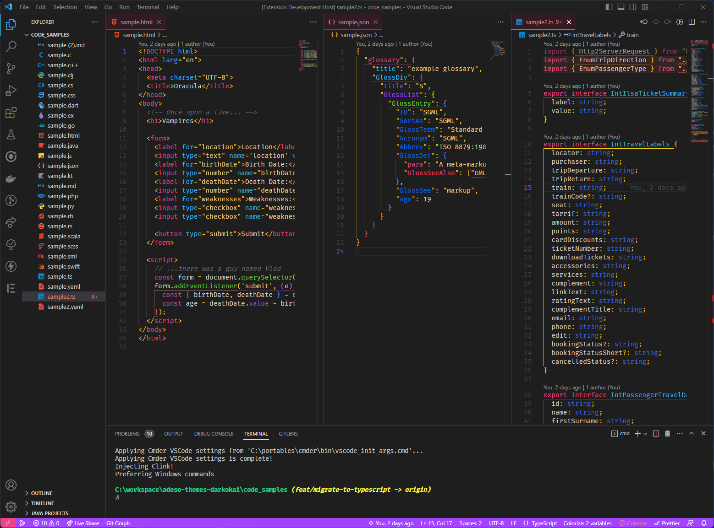

# Darkokai

This dark theme for [Visual Studio Code](http://code.visualstudio.com) is based on the monokai color palette. It aims to give the user a colorful clean interface without so many lines.
Special thanks to [Darcula theme](https://draculatheme.com/) for inspiring and sharing your sample project.

## Snapshot

## Main colors

&shy; 
&shy;
&shy;
&shy; 
&shy;
&shy;
&shy;

## Maintainers

This theme is maintained by [Stephane Margini](https://www.linkedin.com/in/stephane-margini/) from North of Spain ( Asturias).

## License

[MIT License](./LICENSE)

