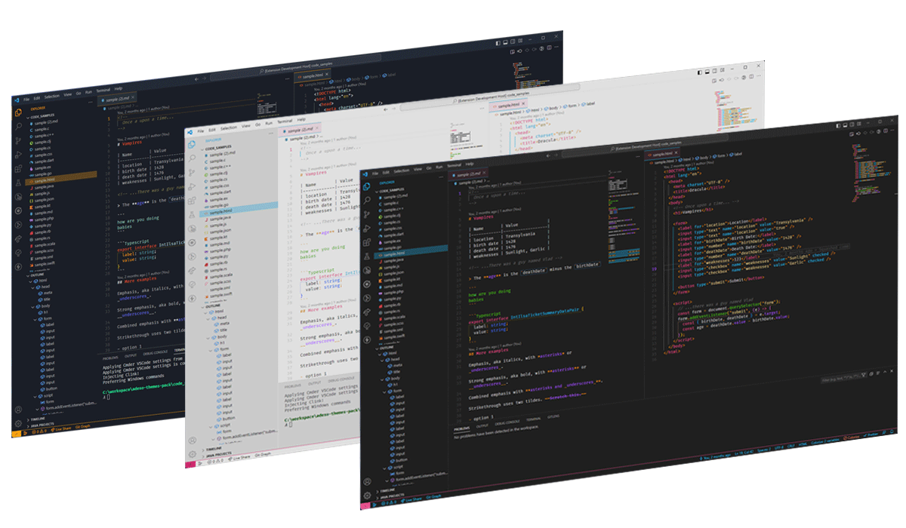

# Monodark

This dark theme for [Visual Studio Code](http://code.visualstudio.com) is based on the monokai color palette. It aims to give the user a colorful clean interface without so many lines.

## Snapshot

## Color Themes

In this theme pack, you can find normal themes and others prepared for colorblind people.

### Monodark

Theme based on the famous Monokai. Use bright colors without disturbing the eye.

&shy; 
&shy;
&shy;
&shy; 
&shy;
&shy;
&shy;

### Mono light

This theme tries to bring the colors of Monokai to the light side. If you like light themes, try this one.

&shy; 
&shy;
&shy;
&shy; 
&shy;
&shy;
&shy;

### Universal Dark

This theme tries to fit in all types of vision. Whether you are color blind or not. Protanopia, deuteranopia, and tritanopia compatible.

&shy; 
&shy;
&shy;
&shy; 
&shy;
&shy;
&shy;

## Maintainers

This theme is maintained by [Stephane Margini](https://www.linkedin.com/in/stephane-margini/) from North of Spain ( Asturias).

## Special thanks

To [Darcula theme](https://draculatheme.com/) for inspiring and sharing your sample project.

To [David Nichols](https://davidmathlogic.com/) for his colorblind [online tool](https://davidmathlogic.com/colorblind/).

To Microsoft for making and maintaining the best free open source editor.

## License

[MIT License](./LICENSE)

