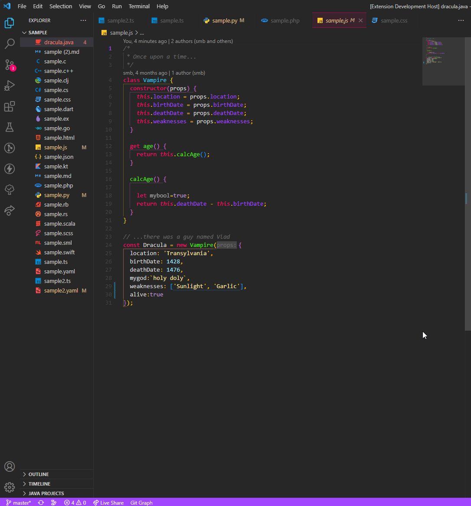
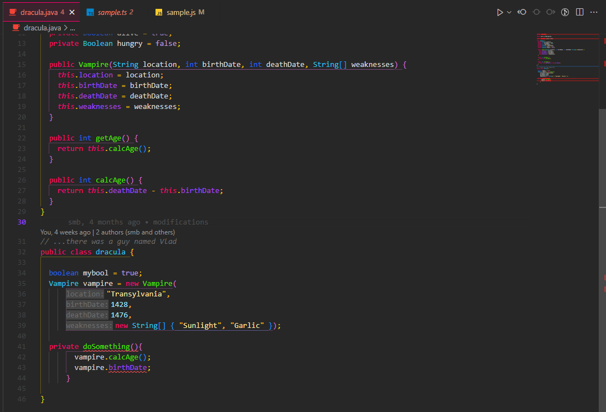

# Darkokai

> Currently in Alpha phase and may undergo changes.

This dark theme for [Visual Studio Code](http://code.visualstudio.com) is based on the monokai color palette. It aims to give the user a clean interface without so many lines.
Special thanks to [Darcula theme](https://draculatheme.com/) for inspiring and sharing your sample project.

## Features:

Colors in tabs to indicate more clearly which is the active window.

Interface with fewer lines, or more discrete lines.

Support for different languages.

## Maintainers

This theme is maintained by Stephane Margini from North of Spain ( Asturias)

## License

[MIT License](./LICENSE)
